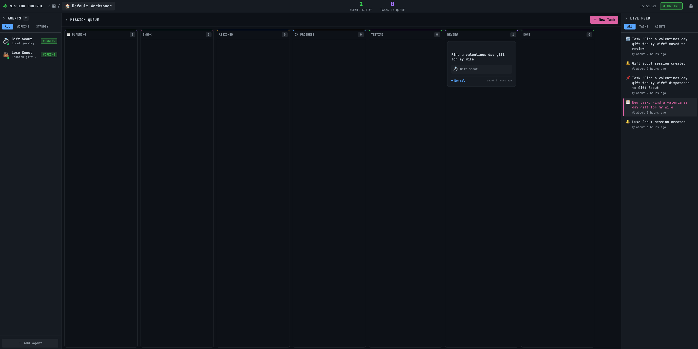

# Mission Control 🎮

**AI Agent Orchestration Dashboard**

Mission Control is a task management system that lets you create tasks, plan them through an AI-guided Q&A process, and automatically dispatch them to AI agents for execution. Think of it as a project manager for AI workers.

  

> **🎉 v1.0.0 Released!** First official working build. See [CHANGELOG.md](CHANGELOG.md) for details.



---

## 🎯 What Does It Do?

1. **Create Tasks** - Add tasks with a title and description
2. **AI Planning** - An AI asks you clarifying questions to understand exactly what you need
3. **Agent Creation** - Based on your answers, the AI creates a specialized agent for the job
4. **Auto-Dispatch** - The task is automatically sent to the agent
5. **Execution** - The agent works on your task (browses web, writes code, creates files, etc.)
6. **Delivery** - Completed work is delivered back to Mission Control

---

## 🏗️ Architecture Overview

```
┌─────────────────────────────────────────────────────────────────┐
│                        YOUR COMPUTER                            │
│                                                                 │
│  ┌─────────────────┐         ┌─────────────────────────────┐   │
│  │ Mission Control │ ◄─────► │     OpenClaw Gateway        │   │
│  │   (Next.js)     │   WS    │  (AI Agent Runtime)         │   │
│  │   Port 3000     │         │  Port 18789                 │   │
│  └─────────────────┘         └─────────────────────────────┘   │
│         │                              │                        │
│         ▼                              ▼                        │
│  ┌─────────────┐              ┌─────────────────┐              │
│  │   SQLite    │              │   AI Provider   │              │
│  │  Database   │              │ (Anthropic/etc) │              │
│  └─────────────┘              └─────────────────┘              │
└─────────────────────────────────────────────────────────────────┘
```

**Mission Control** = The dashboard you interact with (this project)  
**OpenClaw Gateway** = The AI runtime that actually executes tasks (separate project)

---

## 📋 Prerequisites

Before you start, you need:

### 1. Node.js (v18 or higher)
Check if you have it:
```bash
node --version
```
If not, download from: https://nodejs.org/

### 2. OpenClaw Gateway
Mission Control needs OpenClaw to run AI agents. You have two options:

**Option A: Install OpenClaw (Recommended)**
```bash
npm install -g openclaw
```

**Option B: Use an existing OpenClaw instance**
If someone else is running OpenClaw on your network, you just need the URL and token.

### 3. An AI API Key
OpenClaw needs access to an AI provider. Supported providers:
- **Anthropic** (Claude) - Recommended
- **OpenAI** (GPT-4)
- **Google** (Gemini)
- Others via OpenRouter

---

## 🚀 Installation

### Step 1: Clone the Repository

```bash
git clone https://github.com/crshdn/mission-control.git
cd mission-control
```

### Step 2: Install Dependencies

```bash
npm install
```

### Step 3: Create Environment File

Create a file called `.env.local` in the project root:

```bash
touch .env.local
```

Open it in a text editor and add:

```env
# OpenClaw Gateway Connection
OPENCLAW_GATEWAY_URL=ws://127.0.0.1:18789
OPENCLAW_GATEWAY_TOKEN=your-openclaw-token-here

# Optional: Custom port for Mission Control
PORT=3000
```

**How to get these values:**

| Variable | Where to find it |
|----------|------------------|
| `OPENCLAW_GATEWAY_URL` | The WebSocket URL where OpenClaw is running. Default is `ws://127.0.0.1:18789` for local. For remote, use `wss://your-server.example.com` |
| `OPENCLAW_GATEWAY_TOKEN` | Found in your OpenClaw config file at `~/.openclaw/openclaw.json` under `gateway.token` |

### Step 4: Start OpenClaw (if not already running)

In a **separate terminal**:

```bash
# First time setup - this will guide you through configuration
openclaw init

# Start the gateway
openclaw gateway start
```

OpenClaw will ask you to configure your AI provider (like Anthropic). Follow the prompts.

### Step 5: Start Mission Control

Back in the Mission Control directory:

```bash
npm run dev
```

You should see:
```
▲ Next.js 15.x.x
- Local: http://localhost:3000
```

### Step 6: Open in Browser

Go to: **http://localhost:3000**

🎉 You should see the Mission Control dashboard!

---

## 📖 How to Use

### Creating Your First Task

1. Click the **"+ New Task"** button
2. Enter a title (e.g., "Research best coffee machines under $200")
3. Add a description with any details
4. Click **Create**

### The Planning Process

1. Your task appears in the **PLANNING** column
2. Click on it to start planning
3. An AI will ask you questions to understand exactly what you need:
   - What's the goal?
   - Who's the audience?
   - Any constraints?
4. Answer each question by selecting an option or typing your own
5. When planning is complete, an agent is automatically created and assigned

### Watching Your Agent Work

1. The task moves to **IN PROGRESS**
2. The agent starts working (you might see browser windows open, files being created, etc.)
3. When done, the task moves to **REVIEW**
4. Check the deliverables and mark as **DONE**

### Task Workflow

```
PLANNING → INBOX → ASSIGNED → IN PROGRESS → TESTING → REVIEW → DONE
```

You can drag tasks between columns manually, or let the system auto-advance them.

### Mission Planner (Codex 5.3)

Each workspace includes a **Mission Planner** panel in the right sidebar that can:

1. Pull live workload metrics (overdue work, stale in-progress tasks, throughput, test failures)
2. Generate a schedule for the next 1-14 days
3. Recommend performance checks and risk controls

If `OPENAI_API_KEY` is configured, the planner uses `MISSION_CONTROL_CODEX_MODEL` (default: `codex5.3`).
If no key is configured, Mission Control returns a deterministic fallback plan so the workflow still works.

---

## ⚙️ Configuration

### Environment Variables

| Variable | Required | Default | Description |
|----------|----------|---------|-------------|
| `OPENCLAW_GATEWAY_URL` | Yes | `ws://127.0.0.1:18789` | WebSocket URL to OpenClaw Gateway |
| `OPENCLAW_GATEWAY_TOKEN` | Yes | - | Authentication token for OpenClaw |
| `PORT` | No | `3000` | Port for Mission Control web server |
| `OPENAI_API_KEY` | No | - | API key for the workspace Mission Planner endpoint (`/api/workspaces/{id}/codex`) |
| `MISSION_CONTROL_CODEX_MODEL` | No | `codex5.3` | Model used by Mission Planner when `OPENAI_API_KEY` is set |
| `MISSION_CONTROL_AGENT_TOKEN` | No | - | Optional shared bearer token required by agent write endpoints |
| `MISSION_CONTROL_MAX_UPLOAD_BYTES` | No | `1048576` | Max size for `/api/files/upload` payloads |

### OpenClaw Configuration

Your OpenClaw config lives at `~/.openclaw/openclaw.json`. Key settings:

```json
{
  "gateway": {
    "mode": "local",
    "token": "your-secret-token"
  },
  "providers": {
    "anthropic": {
      "apiKey": "${ANTHROPIC_API_KEY}"
    }
  },
  "defaultModel": "anthropic/claude-sonnet-4-5"
}
```

**Important:** Store API keys in `~/.openclaw/.env`, not directly in the config:

```env
# ~/.openclaw/.env
ANTHROPIC_API_KEY=sk-ant-xxxxx
```

---

## 🌐 Multi-Machine Setup

You can run Mission Control and OpenClaw on different computers.

### Example: Mission Control on Computer A, OpenClaw on Computer B

**On Computer B (OpenClaw):**

1. Configure OpenClaw to accept remote connections:
```json
{
  "gateway": {
    "mode": "local",
    "token": "your-secret-token"
  }
}
```

2. Make sure port 18789 is accessible (firewall, etc.)

3. Start OpenClaw:
```bash
openclaw gateway start
```

**On Computer A (Mission Control):**

1. Set the remote URL in `.env.local`:
```env
OPENCLAW_GATEWAY_URL=ws://192.168.1.100:18789
OPENCLAW_GATEWAY_TOKEN=your-secret-token
```

Replace `192.168.1.100` with Computer B's IP address.

### Using Tailscale (Recommended for Remote)

If your machines are on different networks, use [Tailscale](https://tailscale.com/) for secure connections:

```env
OPENCLAW_GATEWAY_URL=wss://your-machine-name.tailnet-name.ts.net
OPENCLAW_GATEWAY_TOKEN=your-secret-token
```

---

## 🗄️ Database

Mission Control uses SQLite for storage. The database file is automatically created at:

```
./mission-control.db
```

### Resetting the Database

To start fresh, simply delete the database file:

```bash
rm mission-control.db
```

It will be recreated on next startup.

### Viewing the Database

You can use any SQLite viewer, or the command line:

```bash
sqlite3 mission-control.db
.tables
SELECT * FROM tasks;
```

---

## 🔧 Troubleshooting

### "Failed to connect to OpenClaw Gateway"

**Cause:** Mission Control can't reach OpenClaw.

**Solutions:**
1. Make sure OpenClaw is running: `openclaw gateway status`
2. Check the URL in `.env.local` is correct
3. Verify the token matches OpenClaw's config
4. Check firewall isn't blocking port 18789

### "Planning questions not loading"

**Cause:** The AI response is slow or failed.

**Solutions:**
1. Check OpenClaw logs: `openclaw gateway logs`
2. Verify your AI API key is valid
3. Try refreshing and clicking the task again

### "Agent not working on task"

**Cause:** Dispatch may have failed.

**Solutions:**
1. Check the Events panel in Mission Control
2. Look for errors in the browser console (F12)
3. Check OpenClaw logs for errors

### Port Already in Use

```bash
# Find what's using port 3000
lsof -i :3000

# Kill it (replace PID with the actual number)
kill -9 PID

# Or use a different port
PORT=3001 npm run dev
```

---

## 📁 Project Structure

```
mission-control/
├── src/
│   ├── app/                 # Next.js pages and API routes
│   │   ├── api/            # Backend API endpoints
│   │   │   ├── tasks/      # Task CRUD operations
│   │   │   ├── agents/     # Agent management
│   │   │   └── openclaw/   # OpenClaw proxy endpoints
│   │   └── page.tsx        # Main dashboard page
│   ├── components/         # React components
│   │   ├── MissionQueue.tsx    # Kanban board
│   │   ├── TaskModal.tsx       # Task create/edit modal
│   │   └── ...
│   └── lib/                # Utilities and core logic
│       ├── db/             # Database setup and queries
│       ├── openclaw/       # OpenClaw client
│       └── store.ts        # State management
├── .env.local              # Your environment config (create this)
├── package.json
└── README.md
```

---

## 🤝 Contributing

Contributions are welcome! Please:

1. Fork the repository
2. Create a feature branch: `git checkout -b feature/amazing-feature`
3. Commit your changes: `git commit -m 'Add amazing feature'`
4. Push to the branch: `git push origin feature/amazing-feature`
5. Open a Pull Request

---

## 📜 License

MIT License - see [LICENSE](LICENSE) for details.

---

## 🙏 Acknowledgments

- Built with [Next.js](https://nextjs.org/)
- Powered by [OpenClaw](https://github.com/openclaw/openclaw)
- AI by [Anthropic](https://anthropic.com/), [OpenAI](https://openai.com/), and others

---

## 💬 Support

- **Issues:** [GitHub Issues](https://github.com/crshdn/mission-control/issues)
- **Discussions:** [GitHub Discussions](https://github.com/crshdn/mission-control/discussions)

---

**Happy orchestrating!** 🚀
